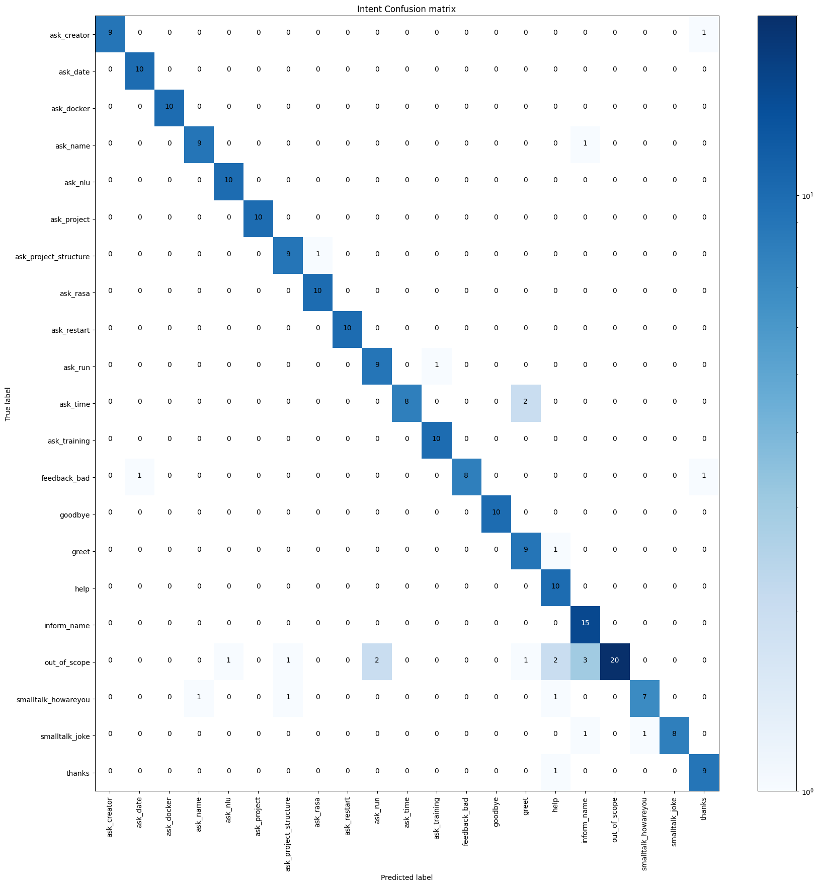
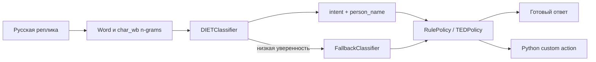

# Русскоязычный intent-based ассистент на Rasa

Восстановленный и заново обученный дипломный проект Хуршида Мухаммадиева.
Это классическая диалоговая система: она не генерирует текст через LLM и не
обращается к внешнему API, а обучается на собственном размеченном корпусе,
распознаёт намерение пользователя и выбирает подготовленный ответ или действие.

Проект специально оставлен CLI-first. Веб-интерфейс и публичный REST API здесь
не нужны: основная работа — данные, ML/NLU, оценка качества и воспроизводимый
запуск.

## Результат

Финальная модель обучена на 795 русскоязычных примерах и оценена на 235
отложенных test-сообщениях. Test split не участвовал в обучении; после выбранного
финального прогона train и конфигурация модели не изменялись.

| Метрика | Результат |
|---|---:|
| Raw Intent Accuracy | **89,36%** |
| Intent Macro-F1 | **90,23%** |
| Intent Weighted-F1 | **89,26%** |
| `person_name` token/tag F1 | **87,80%** |
| Строгая accuracy после fallback | **88,94%** |
| Coverage без fallback | **97,02%** |
| Selective accuracy | **91,67%** |

Полный отчёт: [results/final/summary.md](results/final/summary.md). История двух
итераций и прирост от улучшения данных: [results/experiments.md](results/experiments.md).



Все цифры получены реальным запуском закреплённого окружения. Корпус составлен
вручную/синтетически, поэтому эти метрики не выдаются за качество на сообщениях
реальных пользователей.

## Что обучается

- 21 пользовательский intent: приветствие, помощь, вопросы о проекте, Rasa,
  NLU, обучении, запуске, Docker, времени и другие сценарии;
- `DIETClassifier` классифицирует intent и извлекает сущность `person_name`;
- slot `user_name` хранит найденное имя в пределах текущей сессии;
- `FallbackClassifier` безопасно отклоняет запросы с низкой уверенностью;
- `RulePolicy` и `TEDPolicy` выбирают следующий ответ или custom action;
- четыре Python-action возвращают возможности, запоминают имя и называют дату
  или время Ташкента.

Примеры маршрутизации:

```text
«Кто разработал помощника?»
  → ask_creator → utter_creator

«Меня зовут Азамат»
  → inform_name + person_name="Азамат" → action_remember_name

неподдерживаемая тема
  → out_of_scope или nlu_fallback → ограниченный безопасный ответ
```

## Архитектура



Стек закреплён для повторяемого запуска: Python 3.10.11, Rasa 3.6.21 и Rasa SDK
3.6.2. У DIET/TED по 100 эпох и `random_seed: 42`. Прямые зависимости закреплены,
но полного lock-файла транзитивных пакетов нет, поэтому побитовая идентичность
переобученной модели не обещается.

## Данные и честная оценка

| Split | Файл | Примеров | Назначение |
|---|---|---:|---|
| train | `data/nlu.yml` | 795 | обучение модели |
| dev | `tests/nlu_dev.yml` | 235 | диагностика и улучшение границ intent |
| test | `tests/nlu_test.yml` | 235 | финальная отложенная оценка |

`tests/static_validate.py` проверяет таксономию, размеры split, YAML-связи,
реализации actions, закреплённые Docker-образы и гигиену разделения данных. Он
автоматически подтверждает:

- отсутствие точных пересечений train/dev/test;
- отсутствие совпадающих train/test-шаблонов после маскировки entity;
- новые значения `person_name` в dev и test;
- по выбранной текстовой эвристике нет пар одного intent между train/test и
  dev/test со score `>= 0,85`.

Последняя проверка чувствительна к выбранной метрике и порогу: она не исключает
семантически близкие фразы и не доказывает статистическую независимость или
качество на реальном пользовательском трафике.

`rasa test nlu` показывает исходное качество классификатора без влияния
fallback. `scripts/evaluate_runtime_nlu.py` отдельно пропускает те же сообщения
через полный pipeline и считает coverage, fallback rate и selective accuracy,
не сохраняя тексты сообщений в runtime-отчёт.

В финальном прогоне fallback отклонил семь сообщений: шесть с ошибочным raw
intent и одно с верным. Поэтому он повысил точность среди принятых intent ценой
3% coverage и снижения строгой общей accuracy на 0,43 процентного пункта.

## Быстрый запуск на Windows

Нужен именно Python 3.10: текущая ветка Rasa 3.6 несовместима с Python 3.11+.

```powershell
py -3.10 -m venv .venv-rasa
.\.venv-rasa\Scripts\python.exe -m pip install -r requirements-dev.txt
```

Проверка, обучение и финальная оценка:

```powershell
powershell -NoProfile -ExecutionPolicy Bypass -File .\scripts\validate.ps1
powershell -NoProfile -ExecutionPolicy Bypass -File .\scripts\train.ps1 -Force
powershell -NoProfile -ExecutionPolicy Bypass -File .\scripts\evaluate.ps1
```

Оценка выполняет три прохода: штатный `rasa test nlu`, полный NLU pipeline с
`FallbackClassifier` и Core-тест диалоговой политики на той же модели. Модели
сохраняются в `models/`, а отчёты — в `results/final/`.

Интерактивный разговор:

```powershell
powershell -NoProfile -ExecutionPolicy Bypass -File .\scripts\chat.ps1
```

Скрипт скрыто запускает локальный action server, ждёт его healthcheck, открывает
`rasa shell` и завершает фоновый процесс при выходе.

## Запуск через Docker

Docker не публикует HTTP-порты: контейнеры используются только для
воспроизводимого CLI-запуска.

```powershell
docker compose run --rm --no-deps rasa data validate --fail-on-warnings
docker compose run --rm --no-deps rasa train
docker compose run --rm rasa
docker compose down
```

Rasa и action server общаются только во внутренней сети Compose через
`endpoints.docker.yml`.

## Проверки

```powershell
# статические инварианты и штатная валидация Rasa
powershell -NoProfile -ExecutionPolicy Bypass -File .\scripts\validate.ps1

# unit-тесты четырёх custom actions
.\.venv-rasa\Scripts\python.exe -m pytest -q

# Core-сценарии для уже обученной модели
.\.venv-rasa\Scripts\python.exe -m rasa test core `
  --model .\models\<model>.tar.gz `
  --stories .\tests\test_stories.yml `
  --out .\results\core
```

Проверенный результат Core: **10/10 историй и 47/47 действий**, из которых 23 —
технические `action_listen`. Это Core-only проверка с заранее заданными gold
intents, а не end-to-end оценка распознавания пользовательских фраз. GitHub
Actions выполняет schema/data/unit checks, но намеренно не обучает DIET/TED на
каждом push; зелёный CI сам по себе не подтверждает ML-метрики.

## Структура репозитория

```text
actions/                  custom actions на Python
data/                     train NLU, rules и stories
scripts/                  validate/train/evaluate/chat
tests/                    dev/test NLU, Core и unit-тесты
results/final/            реальные отчёты выбранной модели
config.yml                NLU pipeline и dialogue policies
domain.yml                intents, entity, slot, ответы и actions
docker-compose.yml        CLI-only контейнерный запуск
requirements*.txt         закреплённые зависимости
```

Модели, виртуальные окружения, личные DOCX/PPTX/PDF, логи и старые копии проекта
исключены из Git. Для публичного репозитория подготовлены только код, данные и
проверяемые результаты экспериментов.

## Ограничения

- test-данные не являются выборкой из реального пользовательского трафика;
- модель выбирает подготовленные ответы и не решает произвольные задачи;
- Rasa Open Source 3.6 — legacy-ветка: её период поддержки уже завершён согласно
  [официальной политике Rasa](https://rasa.com/rasa-product-release-and-maintenance-policy).
  Она оставлена для исторической совместимости учебного проекта, но не
  рекомендуется как основа нового production-сервиса;
- Docker-конфигурация подготовлена, но локальный прогон в этой среде не
  выполнялся из-за отсутствия Docker.

Следующий содержательный шаг для ML-части — собрать анонимный набор реальных
реплик, не изменять по нему train и повторить независимую оценку.

## Лицензия

Код и данные проекта распространяются по лицензии [MIT](LICENSE).
